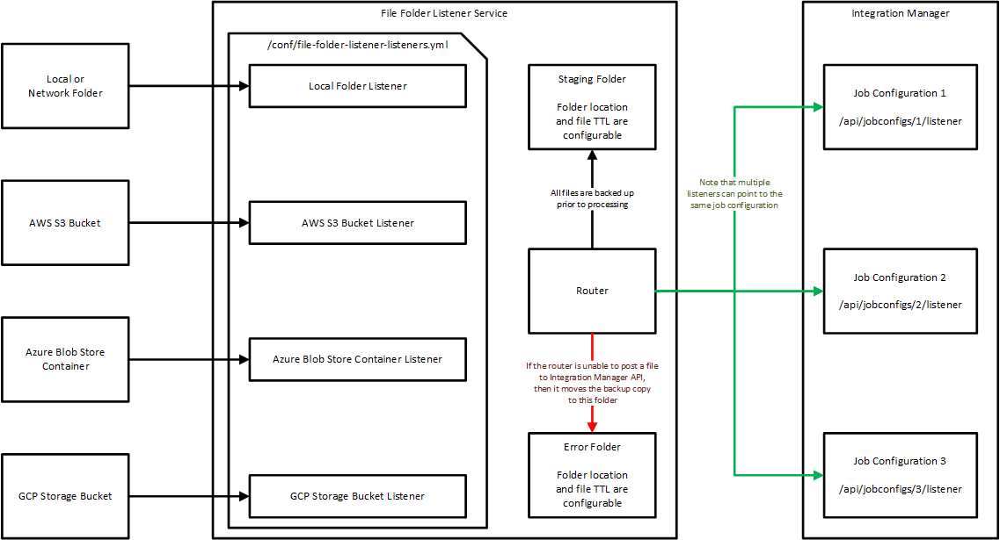

# File Folder Listener

## Overview

The File Folder Listener Service is used to monitor file directories and/or cloud storage buckets/containers for new files. When a new file appears (matching your include/exclude criteria), the associated listener will submit the file to a Job Configuration in Integration Manager. The file will be available to the specified integration process using the $(LOCAL_JOB_SPEC_DIR) macro at runtime. As an example, a file named Accounts.txt will be available as $(LOCAL_JOB_SPEC_DIR)Accounts.txt.



## Basic Configuration

These properties are located in (ProgramDataDirectory)/Actian/FileFolderListener/conf/application.properties.
```
listener.backup-directory= #The folder where backups of successfully submitted files will be stored.
listener.error-directory= #The folder where failed files will be stored, e.g. Exceeded max size, service not running, etc...
```

## Steps to Authorize File Folder Listener Service

The File Folder Listener uses OAuth 2.0 Device Authorization ([https://datatracker.ietf.org/doc/html/rfc8628](https://datatracker.ietf.org/doc/html/rfc8628)) to securely connect to the Integration Manager API.

**We highly recommend enabling HTTPS for your Integration Manager server to protect your data across the wire!**

1. Determine your Integration Manager API base url, e.g.
    * http://im-server-hostname.company.net:8080/api
    * https://im-server-hostname.company.net:443/api
	* https://api.im.actiandatacloud.com:443/v2/api
2. Open a browser window
3. Navigate to the device code retrieval url: (im_api_base_url)/device/code?client_id=file-folder-listener&host=(file_folder_listener_hostname), e.g.
    * http://im-server-hostname.company.net:8080/api/device/code?client_id=file-folder-listener&host=file-folder-listener-hostname.company.net
    * https://im-server-hostname.company.net:443/api/device/code?client_id=file-folder-listener&host=file-folder-listener-hostname.company.net
	* https://api.im.actiandatacloud.com:443/v2/api/device/code?client_id=file-folder-listener&host=file-folder-listener-hostname.company.net
    * Note that "file-folder-listener-hostname" and "im-server-hostname" if they are installed on the same machine (default), but they don't have to be
4. You will be prompted for your Integration Manager User authentication credentials
5. Response should look like:
```
{
  approved: false,
  user_code: "ZEPQ-VOJ8",
  hostname: "file-folder-listener-hostname.company.net",
  device_code: "d4e4b7e7-9072-4562-bf11-9898924556d7",
  verification_uri_complete: "http://im-server-hostname.company.net:8080/api/device/activate?user_code=ZEPQ-VOJ8",
  client_id: "file-folder-listener",
  expires_in: 599,
  interval: 15,
  owner: {
    id: "21368",
    name: "your-username@company.net"
  }
}
```
6. Since you are already authenticated, simply click the device approval url for "verification_uri_complete"
7. Response should look like:
```
# Integration Manager Connection Info
im.base-url=http://im-server-hostname.company.net:8080
im.client-id=file-folder-listener
im.client-secret=afa40ec4-26b1-493e-be71-6a7661d8e474
im.device-code=d4e4b7e7-9072-4562-bf11-9898924556d7
im.user-code=ZEPQ-VOJ8
```
8. Copy and paste the response into the (ProgramDataDirectory)/Actian/FileFolderListener/conf/application.properties file (make sure you delete any duplicate entries first)

## Listener Folder Configuration


## Advanced Configuration
```
listener.retain-backup-files=true &nbsp;#Set this to false to not retain backup files. Error files will still be saved.
listener.backup-directory-max-file-age=7 &nbsp;#How long backup files are retained in day(s).
listener.error-directory-max-file-age=14 &nbsp;#How long error files are retained in day(s).
```

## File Size Configuration and Limitations

File size limitations are governed by the Integration Manager multipart file configuration in (ProgramDataDirectory)/Actian/IntegrationManager/conf/application.properties.

For example to support 100MB file size:
```
# MultipartFiles
spring.servlet.multipart.enabled=true
spring.servlet.multipart.file-size-threshold=100KB
spring.servlet.multipart.location=${sharedDataPath}/tmp
spring.servlet.multipart.max-file-size=100MB
spring.servlet.multipart.max-request-size=100MB
```

For unlimited file size (not recommended, as results are subject to hardware/os limitations, which could lead to unrecoverable data loss):
```
spring.servlet.multipart.max-file-size=-1
spring.servlet.multipart.max-request-size=-1
```