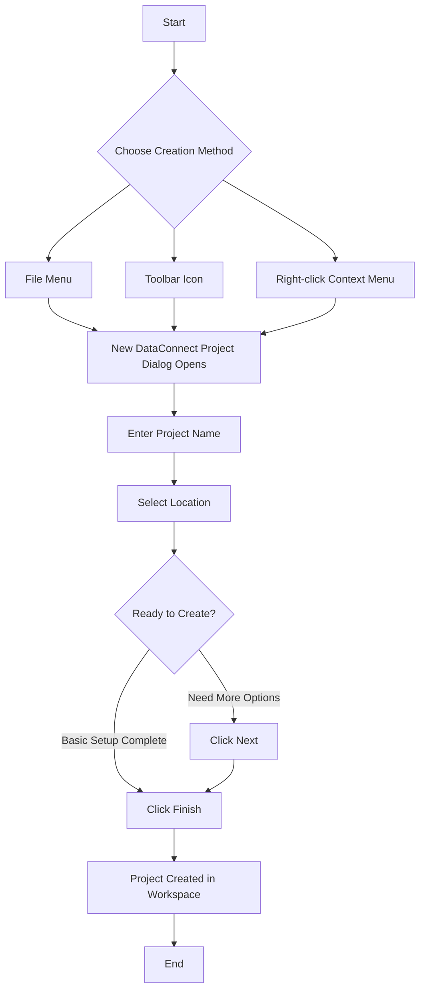

# Creating a DataConnect Project in Actian DataConnect

## What You'll Learn

- What DataConnect projects are and how they organize your work
- Three different methods for creating a new project
- How to configure project settings and location
- Best practices for organizing projects and workspaces

## Introduction

This guide walks you through creating and configuring a DataConnect project in Actian DataConnect Studio. Projects serve as containers for organizing your integration artifacts, including maps, processes, package inventories, and EZscripts within the Eclipse IDE. Whether you're new to DataConnect or setting up a new integration workspace, this guide will help you establish a solid foundation for your work.

## Prerequisites

- Actian DataConnect version 12.2 or higher installed
- Access to Actian DataConnect Studio
- Basic familiarity with the Eclipse IDE interface

## Understanding DataConnect Projects

Before creating your first project, it's helpful to understand how DataConnect organizes your work.

A **DataConnect project** serves as a container for organizing files and design artifacts within the Eclipse IDE. Projects can store both DataConnect-specific artifacts (maps, processes, EZscripts) and general files.

### Workspace Organization

You can organize your work efficiently by:

- Defining multiple projects within a single workspace
- Creating multiple subfolders within each project to group related artifacts

### The Project Explorer

The **Project Explorer** is your primary navigation tool in DataConnect Studio. It displays the contents of your current workspace, including all projects, folders, files, and design artifacts.

**Note:** When you create a project in Project Explorer, DataConnect automatically creates a corresponding folder on your disk within the current workspace directory. All design artifacts you save to the project are stored in this folder location.

## Procedure: Creating a New DataConnect Project

Follow these steps to create a new DataConnect project in Studio.

### Step 1: Open the New DataConnect Project Dialog

You have three options for accessing the project creation dialog. Choose the method that best fits your workflow:

**Method 1 - Using the File Menu:**
Navigate to **File** > **New** > **DataConnect Project** from the top menu bar.

**Method 2 - Using the Toolbar:**
Click the **New** icon on the toolbar and select **DataConnect Project** from the dropdown menu.

**Method 3 - Using the Context Menu:**
Right-click in the **Project Explorer** panel, select **New**, then select **DataConnect Project**.

### Step 2: Configure Project Settings

In the **New DataConnect Project** dialog, configure your project:

1. Enter your desired project name in the **Project name** field (for example, `DC_Sample`)
2. Select the **Use default location** checkbox to set the project's location to the default workspace directory

**Note:** If you use the default location with a project named `DC_Sample`, the full path will be `C:\Actian\DataConnect\workspace\DC_Sample`. You can uncheck **Use default location** to specify a custom directory if needed.

### Step 3: Complete Project Creation

Click **Next** to proceed to additional configuration options, or click **Finish** to create the project immediately with the settings you've specified.

Your new project now appears in the Project Explorer, ready for you to add folders, files, and integration artifacts.

## Troubleshooting

**Issue:** The DataConnect Project option doesn't appear in the New menu.

**Solution:** Verify you have Actian DataConnect version 12.2 or higher installed. Earlier versions may not support this functionality.

**Issue:** Cannot find the Project Explorer panel.

**Solution:** Navigate to **Window** > **Show View** > **Project Explorer** to display the panel if it's been closed.

## Conclusion

You've successfully created a DataConnect project in Actian DataConnect Studio. Your project is now organized within your workspace and ready to store maps, processes, and other integration artifacts. As you continue working, you can create additional projects to organize different integration initiatives or use subfolders within your project to group related artifacts.

## FAQ

**Q: Can I have multiple projects in the same workspace?**  
A: Yes, you can create multiple projects within a single workspace. This helps you organize different integration initiatives or client work separately while accessing them from one Studio instance.

**Q: What happens if I uncheck "Use default location"?**  
A: Unchecking this option allows you to specify a custom directory path for your project. This is useful when you need to store projects in specific locations for organizational or compliance requirements.

**Q: Can I rename a project after creating it?**  
A: Yes, you can rename a project by right-clicking it in the Project Explorer and selecting **Rename**. The folder name on disk will update accordingly.

**Q: What's the difference between a project and a folder?**  
A: A project is a top-level container that DataConnect recognizes as a workspace unit. Folders are subcontainers within projects used to further organize your artifacts. Only projects appear as workspace members in the Project Explorer's root level.

**Q: Where are my projects physically stored on disk?**  
A: By default, projects are stored in `C:\Actian\DataConnect\workspace\[ProjectName]`. Each project corresponds to a folder in this directory containing all your saved artifacts and files.